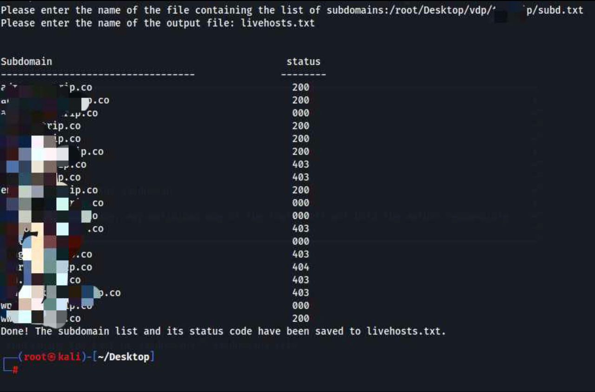

# substat.sh

This is a tool designed to aid you to quickly scan and retrieve the status codes of a list of subdomains, enabling you to efficiently identify which subdomains are accessible and which are not. This feature will save you valuable time and effort by eliminating the need to manually checking each subdomain's accessibility status. 
